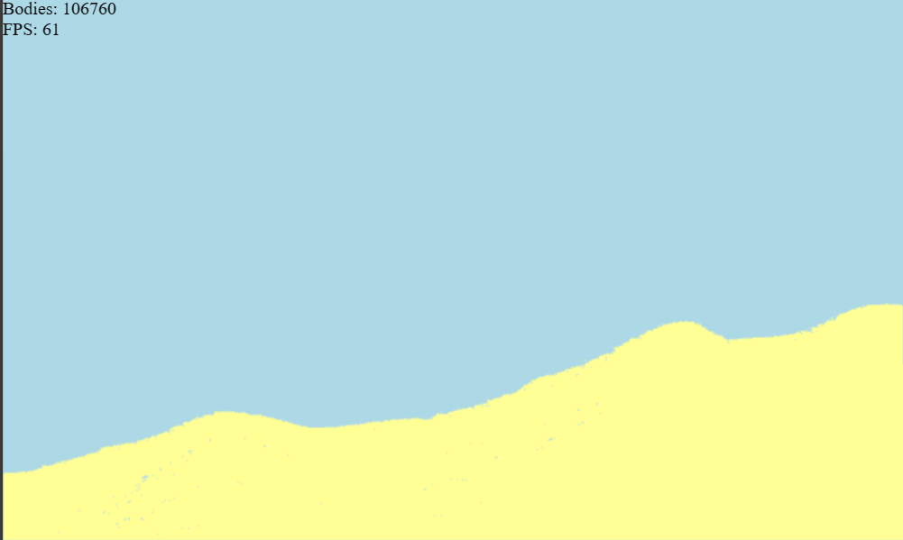

# Sand Simulator

A Sand Simulator.

## Features:

- Can Handle Any amount particles using sleep collision (dont check collision for particles that have not moved for some amount of ticks)
- Renders 100,000 particles at 60fps using WebGL.
- Cellular automata for movement and collision detection.